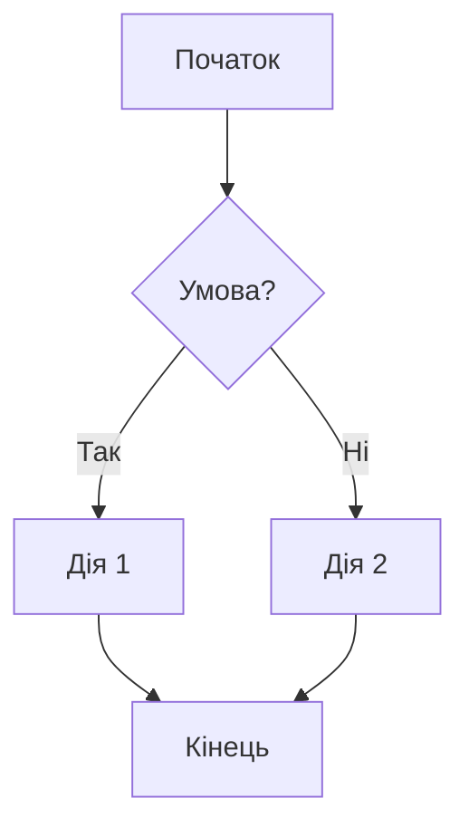
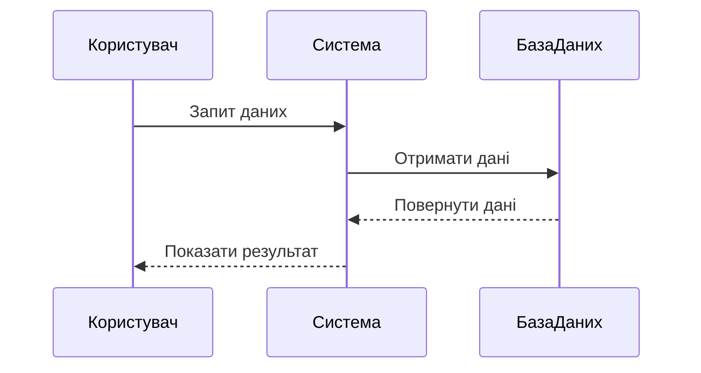
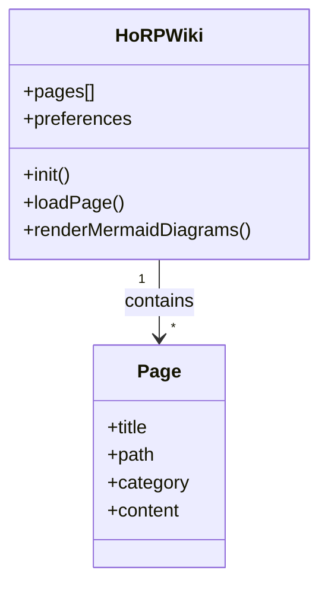
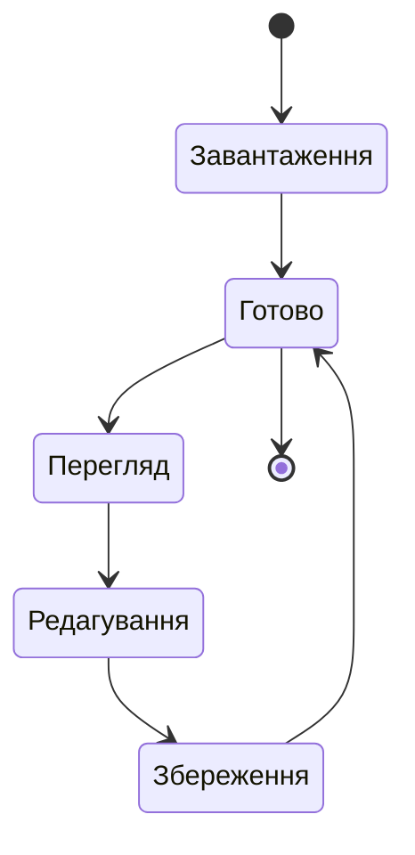
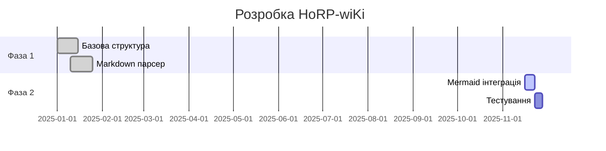
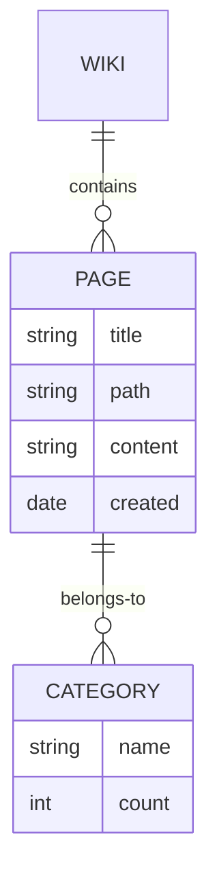
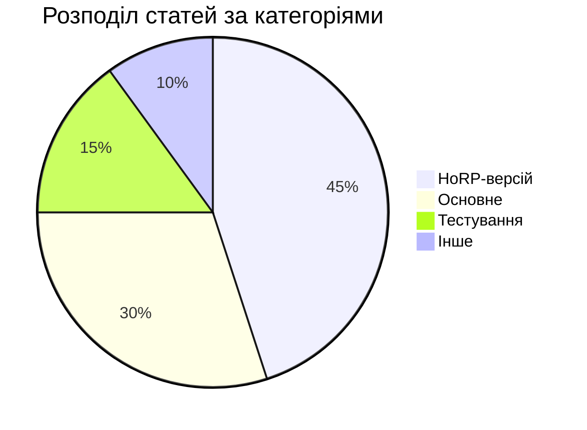

# Тест Mermaid діаграм

Ця сторінка демонструє можливості використання Mermaid діаграм у HoRP-wiKi.

## Блок-схема (Flowchart)

## Діаграма послідовності (Sequence Diagram)

## Діаграма класів (Class Diagram)

## Діаграма станів (State Diagram)

## Діаграма Ганта (Gantt Chart)

## Діаграма сутностей (Entity Relationship)

## Pie Chart (Кругова діаграма)

## Використання

Щоб додати Mermaid діаграму до вашої статті, використовуйте наступний синтаксис:

\`\`\`mermaid
graph LR
    A[Ваш текст] --> B[Інший текст]
\`\`\`

Mermaid підтримує багато типів діаграм. Детальну документацію можна знайти на [офіційному сайті Mermaid](https://mermaid.js.org/).
