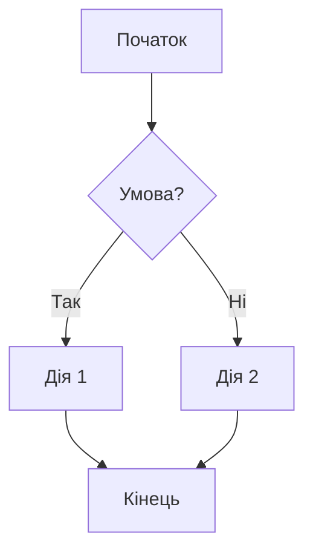
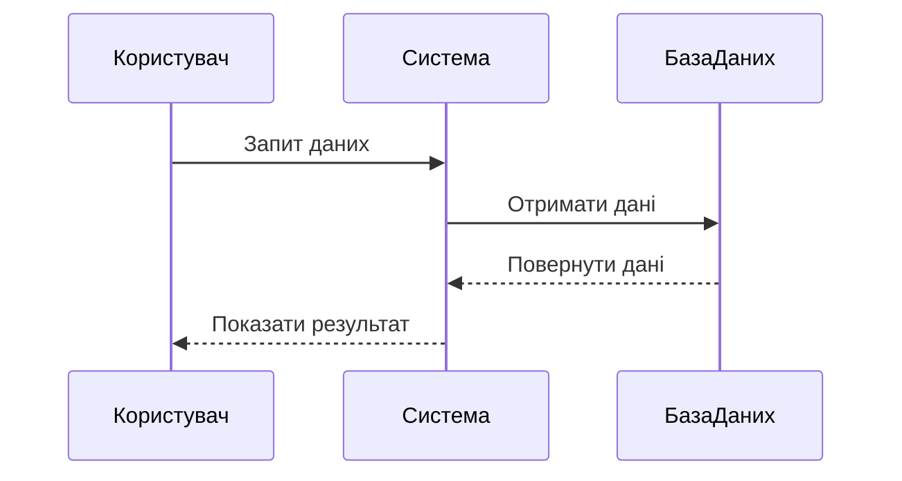
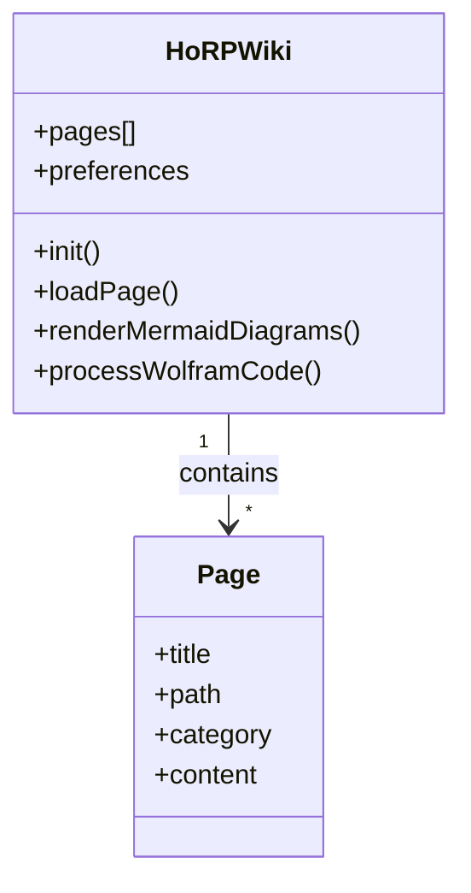
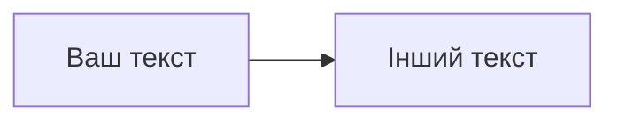
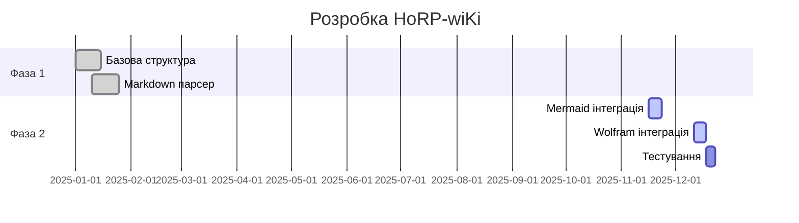

# Демонстрація нових функцій HoRP-wiKi

Ця сторінка демонструє всі нові функції, додані до HoRP-wiKi:

## 1. Mermaid.js Діаграми

### Блок-схема (Flowchart)



### Діаграма послідовності (Sequence Diagram)



### Діаграма класів (Class Diagram)



## 2. Wolfram Інтеграція

### Математичні обчислення

```wolfram
calculate integral of x^2 from 0 to 1
```

### Побудова графіків

```wolfram
plot sin(x) from 0 to 2pi
```

### Тривимірна візуалізація

```wolfram
3d plot x^2 + y^2
```

### Прості обчислення

```wolfram
calculate 42 * 100 / 7
```

## 3. Новий дизайн

### Зміни в дизайні:

- **Спрощений інтерфейс**: Видалено складні градієнти та надмірні анімації
- **Тільки темна тема**: Залишено лише темну тему для кращої читабельності
- **Покращена читабельність**: Фокус на вмісті з мінімальними відволікаючими елементами
- **Плоский дизайн**: Використання плоских кольорів замість градієнтів

### Колір блоків (опціонально)

Ви можете змінити колір блоків через панель налаштувань:

- **Стандартний**: Використовується за замовчуванням
- **Синій**: Синя кольорова схема
- **Зелений**: Зелена кольорова схема
- **Червоний**: Червона кольорова схема
- **Фіолетовий**: Фіолетова кольорова схема

## 4. Використання нових функцій

### Як додати Mermaid діаграму:

```markdown

```

### Як додати Wolfram обчислення:

```markdown
```wolfram
plot sin(x) from 0 to pi
```
```

### Як змінити колір блоків:

1. Натисніть на кнопку налаштувань (⚙️) у верхньому правому куті
2. Виберіть вкладку "Колір блоків"
3. Виберіть бажаний колір
4. Зміни застосуються автоматично

## 5. Приклади використання

### Складні діаграми



### Математичні вирази

```wolfram
solve x^2 + 2x + 1 = 0
```

### Статистичні обчислення

```wolfram
calculate mean of [1, 2, 3, 4, 5]
```

## 6. Технічні деталі

### Підтримка браузерів

- ✅ Chrome 90+
- ✅ Firefox 88+
- ✅ Safari 14+
- ✅ Edge 90+
- ✅ Mobile Safari iOS 14+
- ✅ Chrome Mobile Android 90+

### Вимоги

- ES6+ підтримка
- CSS3 з Grid та Flexbox
- Mermaid.js для діаграм
- Wolfram Alpha API для обчислень (симульовано в демо)

## 7. Відомі обмеження

1. **Wolfram API**: В цій демо-версії використовується симуляція Wolfram відповідей. В реальній версії потрібен API ключ.
2. **Складні діаграми**: Дуже великі діаграми (>1000 вузлів) можуть рендеритися повільно.
3. **Мобільні пристрої**: Деякі складні діаграми можуть бути важкими для перегляду на маленьких екранах.

## 8. Майбутні покращення

- Додавання підтримки LaTeX для математичних формул
- Інтеграція з іншими математичними движками
- Покращена підтримка touch-жестів для діаграм
- Експорт діаграм у різні формати (PNG, SVG, PDF)

Ця сторінка демонструє всі нові можливості HoRP-wiKi. Ви можете використовувати ці функції у своїх статтях для створення більш інтерактивного та інформативного контенту!
