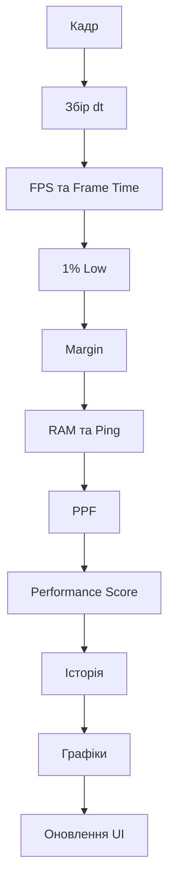
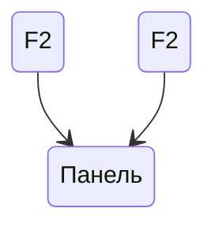

# Монітор продуктивності

## Загальна характеристика

Монітор продуктивності — це вбудована діагностична система, призначена для відображення поточного стану клієнта гри та основних показників продуктивності в реальному часі.

Система працює локально на клієнті та збирає дані безпосередньо під час виконання кадрів. Отримані значення відображаються у компактній інформаційній панелі з поточними показниками, середніми значеннями та короткими графіками історії.

Панель відкривається та приховується клавішею **F2**.

---

## Призначення

Монітор використовується для:

- контролю частоти кадрів;
- аналізу часу обробки кадру;
- виявлення просідань продуктивності;
- контролю використання пам'яті;
- перегляду мережевої затримки;
- аналізу часу рендерингу та логіки;
- оцінки загального Performance Score;
- спостереження за змінами показників у реальному часі.

Система насамперед призначена для діагностики продуктивності під час роботи гри.

---

## Інтерфейс

Панель має компактний вертикальний формат та складається з одинадцяти інформаційних карток.

| Показник | Позначення | Призначення |
|---|---|---|
| FPS | `FPS` | Поточна частота кадрів |
| Frame Time | `FT` | Середній час одного кадру |
| 1% Low | `1%L` | Показник найповільнішої частини кадрів |
| Margin | `MARG` | Запас часу відносно цільового кадру |
| RAM | `RAM` | Використання пам'яті |
| Ping | `PING` | Мережева затримка |
| PPF Total | `PPF T` | Загальний час обробки кадру |
| PPF Render | `PPF R` | Час рендерингу |
| PPF Logic | `PPF L` | Час логічної обробки |
| Average PPF | `AVG` | Середній PPF |
| Performance | `PERF` | Розрахунковий показник продуктивності |

Кожна картка містить основне значення, а для частини параметрів також довгострокове середнє та коротку історію значень.

---

## FPS

**FPS (Frames Per Second)** показує кількість кадрів, які клієнт обробляє за секунду.

У системі використовується цільове значення:

```text
TARGET_FPS = 60
```

Поточний FPS розраховується на основі кількості кадрів та сумарного часу їх обробки за коротке часовe вікно.

Для додаткової оцінки стану використовуються три категорії:

| FPS | Статус |
|---:|---|
| ≥ 55 | `smooth` |
| ≥ 30 | `fair` |
| < 30 | `lag` |

У дужках відображається середній FPS з довгої історії.

---

## Frame Time

**Frame Time (FT)** — середній час, необхідний для обробки одного кадру.

Значення відображається в мілісекундах.

Для цільових 60 FPS використовується бюджет кадру:

```text
1000 / 60 = 16.67 ms
```

Чим менший Frame Time, тим більше часу залишається в межах цільового бюджету кадру.

---

## 1% Low

**1% Low** використовується для оцінки стабільності частоти кадрів.

Для його розрахунку тривалість кадрів сортується, після чого вибирається значення, що відповідає приблизно одному відсотку найповільніших кадрів.

Отримане значення перетворюється назад у FPS.

Показник дозволяє відрізнити стабільну продуктивність від ситуації, коли середній FPS залишається високим, але присутні помітні просідання.

Якщо різниця між поточним FPS та 1% Low перевищує 15 FPS, система позначає стан як:

```text
stutter
```

В інших випадках використовується статус:

```text
stable
```

---

## Margin

**Margin** показує запас або перевищення часу відносно цільового Frame Time.

Розрахунок виконується за формулою:

```text
((TARGET_FT - FrameTime) / TARGET_FT) × 100
```

Позитивне значення означає наявність запасу часу:

```text
headroom
```

Негативне значення означає перевищення цільового бюджету кадру:

```text
overload
```

---

## RAM

Показник **RAM** відображає загальний обсяг використаної пам'яті, отриманий через статистику клієнта.

Значення відображається в мегабайтах.

Для параметра зберігається як поточна коротка історія, так і довша історія для розрахунку середнього значення.

---

## Ping

**PING** відображає мережеву затримку, отриману зі статистики мережі клієнта.

Значення відображається в мілісекундах.

Як і для RAM, система зберігає коротку історію для графіка та довгу історію для розрахунку середнього значення.

---

## PPF

PPF використовується системою для деталізації часу обробки кадру.

Він розділяється на три показники:

- `PPF Total`;
- `PPF Render`;
- `PPF Logic`.

Значення вимірюються в мікросекундах (`µs`).

### PPF Total

`PPF Total` показує загальний розрахований час обробки кадру.

### PPF Render

`PPF Render` показує частину часу, віднесену системою до рендерингу.

Додатково відображається частка рендерингу у відсотках від загального PPF.

### PPF Logic

`PPF Logic` визначає частину часу, що залишилася після врахування часу рендерингу.

Також відображається її частка у відсотках.

---

## Average PPF

`AVG` являє собою середнє значення `PPF Total` з короткої історії.

На відміну від інших параметрів, цей показник уже є усередненим значенням і не отримує додаткового середнього в дужках.

Підпис:

```text
avg over 1s
```

позначає використане коротке часовe вікно.

---

## Performance Score

**Performance Score** — розрахунковий показник, який об'єднує FPS, 1% Low та Margin.

Використовується формула:

```text
FPS × 10 + 1% Low × 8 + max(0, Margin) × 3
```

Результат округлюється до цілого числа.

Для відображення результату використовуються чотири категорії:

| Score | Категорія |
|---:|---|
| > 1000 | `Extreme` |
| > 600 | `High` |
| > 350 | `Medium` |
| ≤ 350 | `Low` |

Окремо система зберігає довгу історію Performance Score та показує її середнє значення.

---

## Історія показників

Для різних завдань система використовує два типи історії.

### Коротка історія

Коротка історія використовується для:

- побудови графіків;
- визначення зміни показника;
- динамічного визначення кольору;
- відображення останніх значень.

Для графіків зберігається до 50 значень, після чого найстаріші значення видаляються.

На самому графіку одночасно відображається до 25 стовпчиків.

### Довга історія

Довга історія містить до 250 значень.

Вона використовується для розрахунку середніх значень:

- FPS;
- Frame Time;
- 1% Low;
- Margin;
- RAM;
- Ping;
- Performance Score.

PPF-показники до довгої історії не додаються.

---

## Графіки

Кожна картка містить компактний стовпчиковий графік.

Висота кожного стовпчика визначається відносним положенням значення між мінімальним та максимальним значеннями поточної історії.

Графік показує короткострокову динаміку параметра, а не абсолютну шкалу.

Колір стовпчиків також залежить від положення значення в історії.

---

## Динамічне забарвлення

Для показників використовується динамічна система кольорів.

Значення оцінюється відносно мінімального та максимального значення його поточної історії.

Для параметрів, де менше значення є кращим, напрям оцінки інвертується.

Основні кольорові області:

- зелена — сприятливіші значення;
- бурштинова — проміжні значення;
- червона — несприятливіші значення.

Це дозволяє оцінювати зміну показника без необхідності постійно порівнювати числа вручну.

---

## Вимірювання фаз кадру

Система використовує `RunService.RenderStepped` та `RunService.Heartbeat` для отримання часових даних.

Початок вимірювання фіксується під час `RenderStepped`, після чого через `Heartbeat` визначається тривалість відповідної фази.

Отриманий результат використовується для розділення PPF на Render та Logic.

---

## Оновлення даних

Основний цикл моніторингу працює під час `RenderStepped`.

Для кожного кадру система:

1. записує час та `dt`;
2. видаляє застарілі значення з короткої історії;
3. розраховує FPS;
4. визначає Frame Time;
5. розраховує 1% Low;
6. визначає Margin;
7. отримує RAM;
8. отримує Ping;
9. розраховує PPF;
10. розраховує Performance Score;
11. оновлює коротку та довгу історію;
12. оновлює інтерфейс;
13. перебудовує графіки.



---

## Відображення панелі

Панель за замовчуванням прихована.

Клавіша **F2** перемикає її стан:



Поява та зникнення виконуються плавно за допомогою Tween-анімацій.

Під час появи одночасно змінюються:

- прозорість панелі;
- позиція;
- масштаб.

Це дозволяє уникнути миттєвої появи інтерфейсу.

---

## Технічні параметри

| Параметр | Значення |
|---|---:|
| Цільовий FPS | 60 |
| Цільовий Frame Time | 16.67 ms |
| Часове вікно FPS | 1 секунда |
| Максимальна довга історія | 250 значень |
| Максимальна коротка історія | 50 значень |
| Кількість стовпчиків графіка | 25 |
| Оновлення PPF | у межах основного циклу кадру |
| Клавіша панелі | F2 |

---

## Особливості

Монітор продуктивності поєднує кілька рівнів діагностики в одному інтерфейсі. Окрім стандартних FPS, RAM та Ping, система дозволяє окремо спостерігати за Frame Time, 1% Low, запасом часу кадру та внутрішнім розподілом PPF.

Використання короткої та довгої історії дозволяє одночасно бачити поточний стан системи, її короткострокову динаміку та середні значення за накопичений період.
