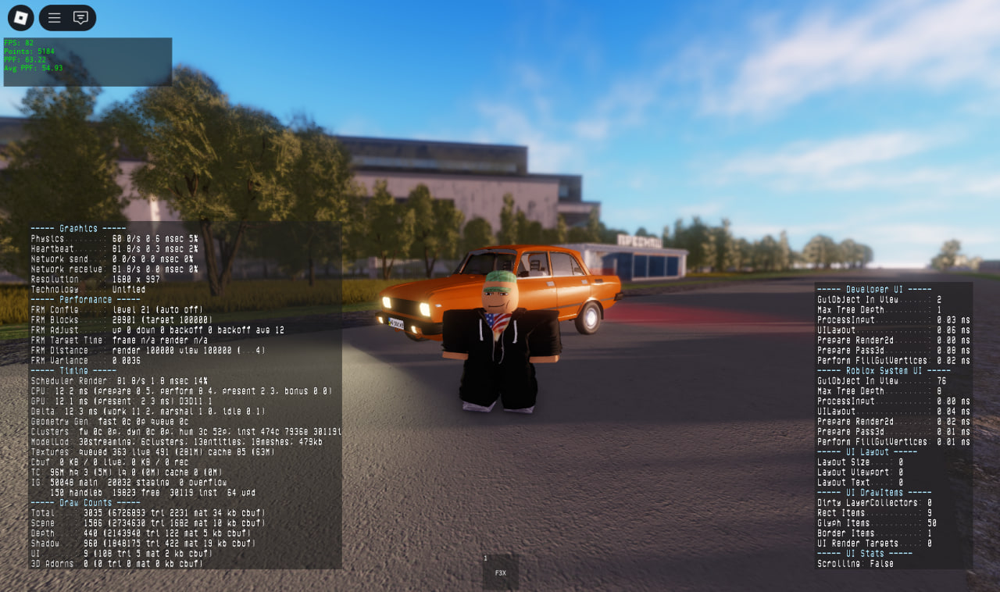

# HoRP — 0.0.6a-g.02

**Дата випуску:** приблизно 19 вересня 2025 року
**Статус:** Alpha
**Build-тег:** `g.02` — *g* (graphics) · *02* (другий графічний патч)

## Зміни та нововведення
- Поліпшення графіки: деталізація текстур, освітлення та тіней.
- Оптимізація ігрового середовища: швидший рендер карти та підвантаження об'єктів.
- Зміни у карті: деякі райони Хриплина оновлені, додані нові деталі для більшої реалістичності.

## Лор
У цій версії гравці почали досліджувати Хриплин більш детально. Деякі частини села отримали відчуття реального життя: будинки, дороги та рельєфи стали більш правдоподібними, а навколишнє середовище — живим та насиченим.

## Скріни

