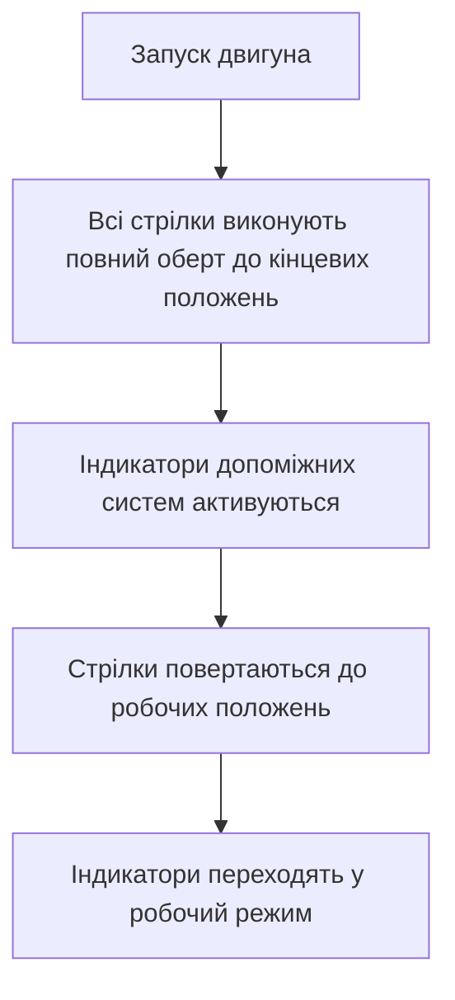

## Огляд

Приладова панель A-Chassis являє собою повноцінний цифровий інтерфейс для відображення всіх основних параметрів роботи транспортного засобу. Панель розроблена з урахуванням реалістичного дизайну автомобільних приладів та забезпечує гравця всією необхідною інформацією для контролю над автомобілем.

## Призначення

Приладова панель призначена для надання гравцеві візуальної інформації про стан транспортного засобу в реальному часі. Вона дозволяє контролювати оберти двигуна, швидкість руху, рівень палива, температуру двигуна, тиск наддуву та стан усіх допоміжних систем водіння.

## Інтерфейс

### Основні елементи приладової панелі

Приладова панель складається з наступних основних елементів:

- **Тахометр** — відображає оберти двигуна (RPM)
- **Спідометр** — показує поточну швидкість руху
- **Індикатор палива** — відображає рівень палива в баку
- **Термометр двигуна** — показує температуру охолоджувальної рідини
- **Буст-метр** — відображає тиск наддуву (турбо/суперчарджер)
- **Індикатор передачі** — показує поточну вибрану передачу
- **Режим трансмісії** — відображає поточний режим (A/T, S/T, M/T)
- **Індикатори допоміжних систем** — TCS, ABS, ESC, CS
- **Індикатор ручного гальма** — показує стан стоянкового гальма
- **Індикатор червоної зони** — попереджає про перевищення обертів двигуна
- **Лічильник швидкості** — цифрове відображення швидкості

*Головний вид приладової панелі з усіма основними елементами*

### Тахометр

Тахометр являє собою кругову шкалу з діапазоном обертів двигуна.

| Характеристика | Опис |
|---|---|
| Шкала | Від 0 до максимальних обертів двигуна |
| Поділки | Основні (кожні 1000 RPM) та додаткові (кожні 250 RPM) |
| Червона зона | Позначена червоним кольором, починається з обертів перемикання |
| Стрілка | Плавно рухається відповідно до поточних обертів |
| Цифрові позначки | Відображають значення в тисячних обертів (x1000 RPM) |

### Спідометр

Спідометр виконаний у вигляді кругової шкали з можливістю перемикання одиниць вимірювання.

**Доступні одиниці:**

- Кілометри за годину (km/h)
- Милі за годину (mph)
- Студії за секунду (sps) — стандартна одиниця Roblox

**Особливості:**

- Перемикання — натискання на цифрове значення швидкості
- Шкала — автоматично масштабується під максимальну швидкість автомобіля
- Поділки — основні та додаткові для точного зчитування
- Стрілка — плавно рухається відповідно до поточної швидкості
- Цифрове відображення — велике число в центрі спідометра

### Індикатор палива

Індикатор палива забезпечує візуальний контроль рівня пального.

| Рівень палива | Індикація |
|---|---|
| Нормальний (>25%) | Індикатор вимкнено |
| Низький (10–25%) | :warning: Помаранчеве попередження |
| Критичний (<10%) | :warning: Червоне попередження |

- Шкала — від 0 до 100% у вигляді кругової дуги
- Позначки — основні поділки (0%, 25%, 50%, 75%, 100%)
- Стрілка — плавно вказує поточний рівень палива

*Активоване попередження про критичний рівень палива*

### Термометр двигуна

Індикатор температури двигуна дозволяє контролювати тепловий режим.

| Температура | Індикація |
|---|---|
| Нормальна (<80°C) | Індикатор вимкнено |
| Підвищена (80–110°C) | :warning: Помаранчеве попередження |
| Перегрів (>110°C) | :fire: Червоне попередження |

- Шкала — від 50°C до 130°C
- Позначки — основні поділки з числовими значеннями
- Стрілка — плавно вказує поточну температуру

*Індикація перегріву двигуна з червоним попередженням*

### Буст-метр

Буст-метр відображає тиск наддуву від турбо- та суперчарджерів.

- Шкала — від 0 до максимального тиску
- Одиниці вимірювання — бар (BAR)
- Стрілка — плавно показує поточний тиск
- Відображення — цифрове значення в центрі приладу
- Активність — прилад відображається лише за наявності наддуву

## Індикатори стану

### Індикатори допоміжних систем

Кожна допоміжна система має власний індикатор:

- **TCS** (Traction Control System) — антипробуксовочна система
- **ABS** (Anti-lock Braking System) — антиблокувальна система гальм
- **ESC** (Electronic Stability Control) — система курсової стійкості
- **CS** (Counter Steering) — система контролю стабільності

**Стани індикаторів:**

| Стан | Значення |
|---|---|
| Активний (білий) | Система увімкнена та працює |
| Неактивний (темний) | Система увімкнена, але не втручається |
| Вимкнений (червоний) | Система вимкнена гравцем |
| Відсутній | Система не підтримується автомобілем |

*Всі допоміжні системи в активному стані*

### Індикатор ручного гальма

| Стан | Значення |
|---|---|
| Активний (білий) | Ручне гальмо затягнуте |
| Неактивний (темний) | Ручне гальмо відпущене |

### Індикатор червоної зони

Попереджає про перевищення рекомендованих обертів двигуна:

- Нормальний стан — темний, без підсвічування
- Перевищення обертів — блимає червоним
- Запуск двигуна — червоне світло під час запуску

## Керування панеллю

### Основні дії

| Дія | Результат |
|---|---|
| Натискання на швидкість | Перемикання одиниць вимірювання (km/h → mph → sps) |
| Натискання на передачу | Перемикання автоматичного зчеплення (увімкнено/вимкнено) |
| Клавіша `G` | Показати/приховати приладову панель |
| Натискання на TCS/ESC | Перемикання стану відповідної системи |
| Натискання на ABS | Перемикання стану ABS |
| Натискання на CS | Перемикання стану CS |
| Натискання на ручне гальмо | Активація/деактивація ручного гальма |
| Натискання на режим трансмісії | Перемикання режиму трансмісії |

### Геймпад

| Кнопка | Результат |
|---|---|
| `L2` | Показати/приховати панель |

## Ігровий процес

### Відображення інформації

Приладова панель оновлюється в реальному часі з частотою до 240 кадрів на секунду. Всі стрілки рухаються плавно завдяки системі інтерполяції, що імітує поведінку справжніх автомобільних приладів.

### Запуск двигуна

При запуску двигуна виконується анімація старту:

*Анімація запуску двигуна з повним обертом стрілок*

### Індикація зчеплення

При натисканні зчеплення (в ручному режимі) індикатор передачі стає напівпрозорим, сигналізуючи про розрив потужності між двигуном та колесами.

### Попереджувальні сигнали

| Сигнал | Умова активації |
|---|---|
| Низький рівень палива | Активується при 25%, інтенсивно попереджає при 10% |
| Перегрів двигуна | Активується при температурі вище 80°C, критичний сигнал при 110°C |
| Перевищення обертів | Блимання червоної зони тахометра |

## Синхронізація

Приладова панель отримує всі дані від системи A-Chassis через серію значень (Values) та оновлюється автоматично при будь-яких змінах параметрів. Всі взаємодії гравця з панеллю передаються до системи керування транспортним засобом, забезпечуючи повну синхронізацію дій гравця з відображенням на панелі.

## Обмеження

- Панель відображається лише коли гравець перебуває всередині транспортного засобу
- Буст-метр доступний лише за наявності турбо- або суперчарджера
- Деякі індикатори можуть бути приховані, якщо відповідні системи не підтримуються автомобілем
- При низькій частоті кадрів можлива затримка оновлення стрілок
- Мобільний інтерфейс не підтримує всі функції взаємодії з панеллю

## Відомі проблеми

- При екстремально високих обертах може виникати невелика затримка в роботі тахометра
- На деяких пристроях анімація запуску може виконуватися з меншою плавністю
- Перемикання одиниць швидкості не зберігається між сесіями

## Усунення несправностей

**Панель не відображається**

- Переконайтеся, що гравець знаходиться всередині транспортного засобу
- Перевірте, чи не прихована панель (клавіша `G` / `L2`)
- Переконайтеся, що транспортний засіб активний та справний

**Стрілки не рухаються**

- Переконайтеся, що двигун запущений
- Перевірте, чи передаються значення від системи до панелі
- Спробуйте вийти з автомобіля та зайти знову

**Неправильні показники швидкості**

- Перевірте вибрані одиниці вимірювання
- Переконайтеся, що автоматичне масштабування налаштовано правильно
- Перевірте налаштування максимальної швидкості автомобіля

**Немає індикаторів допоміжних систем**

- Переконайтеся, що системи підтримуються автомобілем
- Перевірте, чи не вимкнені системи в налаштуваннях
- Переконайтеся, що двигун запущений

## Часті запитання

**Як змінити одиниці вимірювання швидкості?**
Натисніть на велике число в центрі спідометра. Доступні одиниці: km/h, mph, sps.

**Чому індикатор передачі став напівпрозорим?**
Це означає, що зчеплення активне (в ручному режимі) або система перемикає передачу.

**Що означає червоне світло на тахометрі?**
Це попередження про перевищення рекомендованих обертів двигуна. Рекомендується перемкнути передачу вище.

**Як вимкнути звукове попередження про низьке паливо?**
Попередження про низьке паливо є візуальним і не супроводжується звуком.

**Чому буст-метр не відображається?**
Буст-метр відображається тільки якщо автомобіль обладнаний турбо- або суперчарджером.

**Як скинути всі налаштування панелі?**
Налаштування панелі скидаються автоматично при перезаході в гру або при новій посадці в автомобіль.

## Поради

- Використовуйте перемикання одиниць швидкості для зручного порівняння з дорожніми знаками
- Слідкуйте за індикатором температури двигуна при тривалих поїздках
- Звертайте увагу на червону зону тахометра для своєчасного перемикання передач
- Індикатори допоміжних систем допомагають оцінити ефективність водіння
- При активному TCS або ABS слід враховувати, що система обмежує потужність двигуна

## Пов'язані механіки

- Система керування транспортним засобом A-Chassis
- Фізика двигуна та трансмісії
- Допоміжні системи водіння (TCS, ABS, ESC, CS)
- Система палива та витрати пального
- Система охолодження двигуна

## Галерея

*Головний вид приладової панелі з усіма основними елементами*

*Активоване попередження про критичний рівень палива*

*Індикація перегріву двигуна з червоним попередженням*

*Всі допоміжні системи в активному стані*

*Анімація запуску двигуна з повним обертом стрілок*
