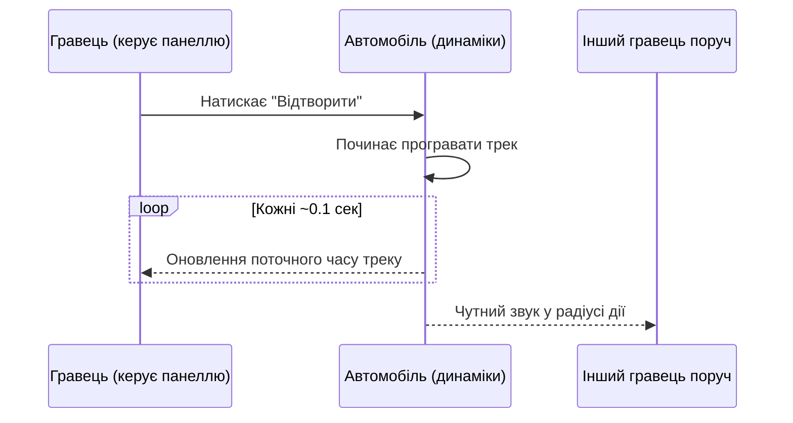

## Огляд

Касетний програвач — це вбудована в автомобіль система відтворення музики. Гравець керує програванням касет через власний інтерфейс, а звук фізично лунає з динаміків автомобіля та чутний іншим гравцям поруч.

Музика відтворюється не локально, а через звукові джерела, розміщені на самому автомобілі. Це означає, що почути програвач можуть усі гравці, які перебувають достатньо близько до машини — не тільки водій.

## Що потрібно, щоб користуватися програвачем

| Вимога | Опис |
|---|---|
| Наявність касет | У рюкзаку гравця повинні бути інструменти (Tool), назва яких починається з `Cassette` |
| Перебування біля/в автомобілі | Інтерфейс і керування прив'язані до конкретного автомобіля |
| Дистанція для прослуховування | Звук чутний іншим гравцям у радіусі приблизно **120 studs** від автомобіля |

Якщо в рюкзаку немає жодної відповідної касети, у списку доступний лише пункт **"None"**, і відтворення музики неможливе.

## Інтерфейс

Панель програвача містить такі елементи:

| Елемент | Призначення |
|---|---|
| Назва треку | Показує назву поточної касети |
| Смуга прогресу | Візуально показує, скільки треку вже відтворено |
| Поточний час | Формат `хв:сек`, оновлюється під час відтворення |
| Загальна тривалість | Показує повну довжину поточного треку у форматі `хв:сек` |

Панель має плавну анімацію появи та зникнення (плавне ковзання знизу екрана разом зі зникненням прозорості елементів).

## Керування

> Усі клавіші керування діють лише тоді, коли панель програвача **видима**.

| Клавіша | Дія |
|---|---|
| `P` | Відтворити поточну касету |
| `U` | Поставити на паузу |
| `R` | Продовжити відтворення з місця паузи |
| `T` | Зупинити відтворення (скидає час до 0) |
| `[` | Наступна касета у списку |
| `]` | Попередня касета у списку |

### Приховування та відображення панелі

Панель програвача можна сховати з екрана, якщо вона заважає огляду:

| Комбінація | Дія |
|---|---|
| Утримувати `0` + натиснути `P` | Показати панель |
| Утримувати `0` + натиснути `U` | Сховати панель |

Поки панель прихована, звичайні клавіші керування (`P`, `U`, `R`, `T`, `[`, `]`) не працюють.

## Вибір касет

Список касет формується автоматично з вмісту рюкзака гравця на момент входу в гру. Перемикання між ними відбувається по колу:

- клавіша `[` переходить до наступної касети у списку;
- клавіша `]` повертається до попередньої;
- після останньої касети список знову починається з першої (і навпаки).

Кожна касета має власну назву та тривалість, яка визначається автоматично на основі аудіофайлу.

## Синхронізація для інших гравців

Музика фізично відтворюється через динаміки автомобіля, тому її чують усі гравці поблизу, а не лише той, хто керує програвачем.

Важливі особливості синхронізації:

- Оновлення поточного часу треку на панелі відбувається приблизно кожні 0.1 секунди, поки трек програється.
- Гравець повинен періодично "відмічатися" біля автомобіля, щоб отримувати оновлення — це відбувається автоматично, поки відкрита панель програвача.
- Якщо гравець надовго перестає надсилати сигнал присутності (наприклад, панель закрита або скрипт зупинено), сервер перестає надсилати йому оновлення часу.
- Звук у самому автомобілі продовжує відтворюватися незалежно від того, чи стежить хтось за прогресом на панелі.

## Можливі ситуації

- **Немає касет у рюкзаку.** Доступний лише пункт "None", відтворення неактивне.
- **Гравець від'їхав далеко від автомобіля.** Музику з динаміків більше не чутно, оскільки дистанція перевищує радіус дії звуку.
- **Панель прихована.** Керування треком тимчасово недоступне, поки панель знову не показано.
- **Пауза та відновлення.** Після паузи трек можна продовжити з того самого моменту, натиснувши `R`.
- **Зупинка треку.** Після зупинки прогрес скидається на початок треку.

## Обмеження

- Немає окремого регулятора гучності на панелі гравця.
- Немає підтримки повторного циклічного відтворення (looping) — трек не запускається автоматично знову після завершення.
- Список касет формується один раз при вході в гру; касети, отримані пізніше, у поточному списку не з'являться без перезавантаження інтерфейсу.
- Радіус чутності звуку обмежений — за його межами музика не чутна навіть іншим гравцям поблизу автомобіля.

## Усунення несправностей

| Проблема | Можлива причина |
|---|---|
| Панель не реагує на керування | Панель, ймовірно, прихована — спробуйте комбінацію показу панелі |
| Немає доступних касет | У рюкзаку відсутні предмети з назвою, що починається на "Cassette" |
| Не показується тривалість треку | Аудіофайл ще завантажується або мав помилку завантаження |
| Інші гравці не чують музику | Вони можуть перебувати за межами радіуса дії звуку (~120 studs) |

## Поради

- Тримайте панель прихованою, коли керування нею не потрібне, щоб не заважала огляду.
- Використовуйте паузу замість зупинки, якщо плануєте повернутися до того самого моменту треку.
- Перевіряйте назву треку на панелі перед відтворенням, щоб переконатися, що обрано потрібну касету.

## Пов'язані механіки

- Автомобілі
- Інструменти (Tools) гравця
- Аудіосистема гри
