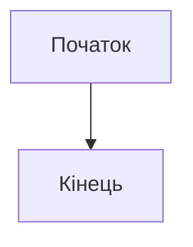
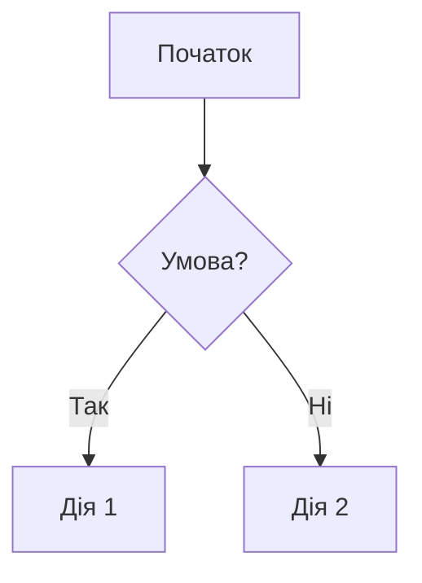
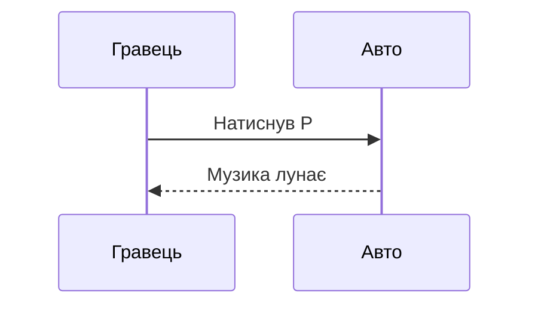
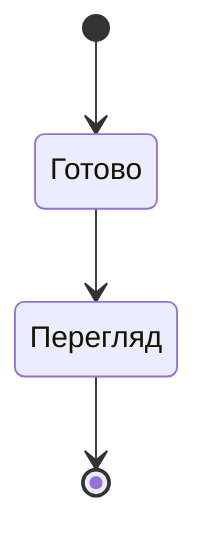
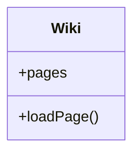
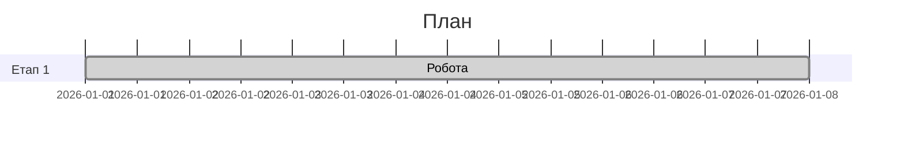
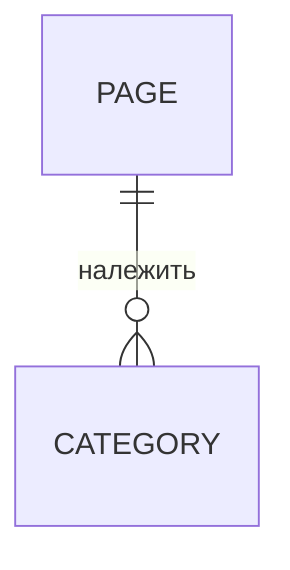
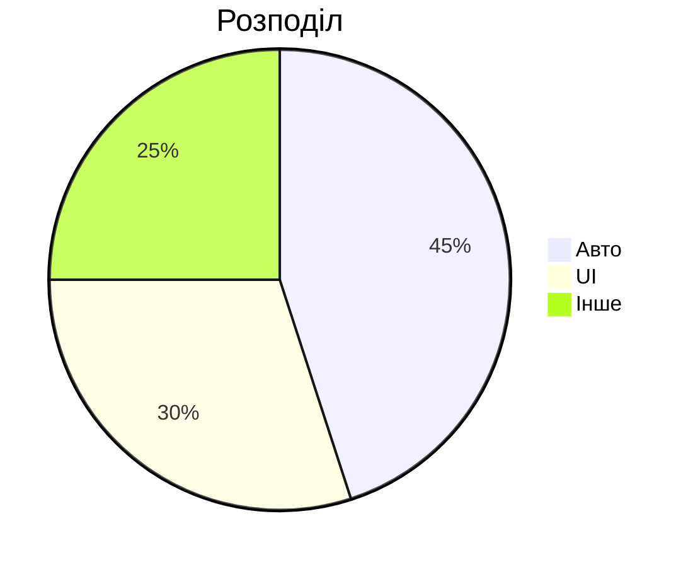

# Діаграми Mermaid

Mermaid дозволяє малювати схеми **текстом**. Замість графічного редактора ви пишете код — і отримуєте картинку. Ідеально для механік гри.

## Як вставити

Оформіть блок коду з мовою `mermaid`:

````markdown

````

## Тип 1: Блок-схема (graph / flowchart)



Синтаксис:
- `A[текст]` — прямокутник.
- `B{текст}` — ромб (рішення).
- `X --> Y` — стрілка.
- `X -->|підпис| Y` — стрілка з підписом.
- Напрямки: `TD` (згори вниз), `LR` (зліва направо), `TB`, `RL`, `BT`.

## Тип 2: Послідовність (sequenceDiagram)



- `->>` — стрілка з запитом.
- `-->>` — пунктирна (відповідь).
- `loop ... end` — цикл.

## Тип 3: Стани (stateDiagram-v2)



## Тип 4: Класова діаграма (classDiagram)



## Тип 5: Гант (gantt)



## Тип 6: Сутність–зв'язок (erDiagram)



## Тип 7: Кругова (pie)



## Поширені помилки

- **Одна друкарська помилка** — і вся діаграма не збудується.
- Не вставляйте Markdown/HTML усередину блоку `mermaid`.
- Перевіряйте дужки та стрілки. Тестуйте на mermaid.js.org.

## Пов'язані матеріали

- [Підручник автора](Підручник%20автора) — розділ "Mermaid"
- [Тест Mermaid](Тестування/mermaid-test)
