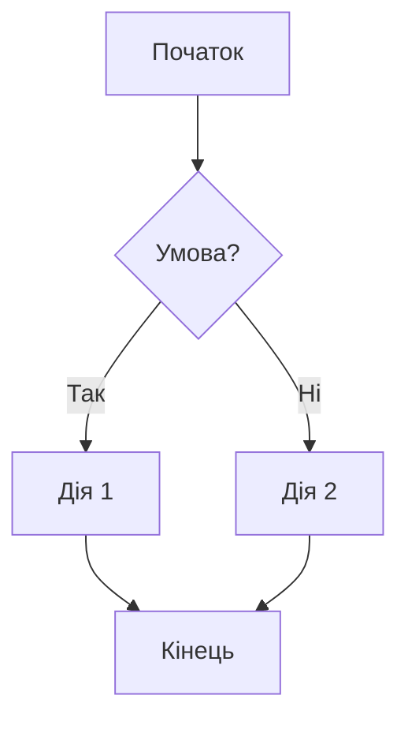
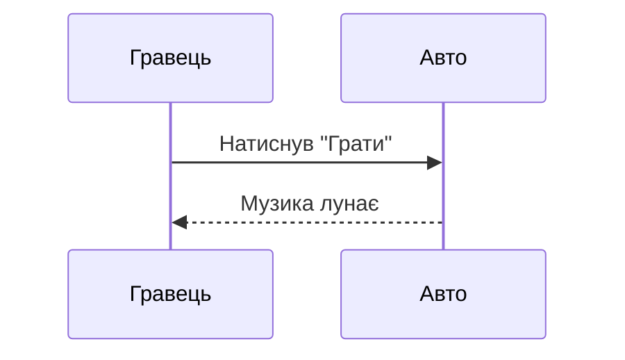
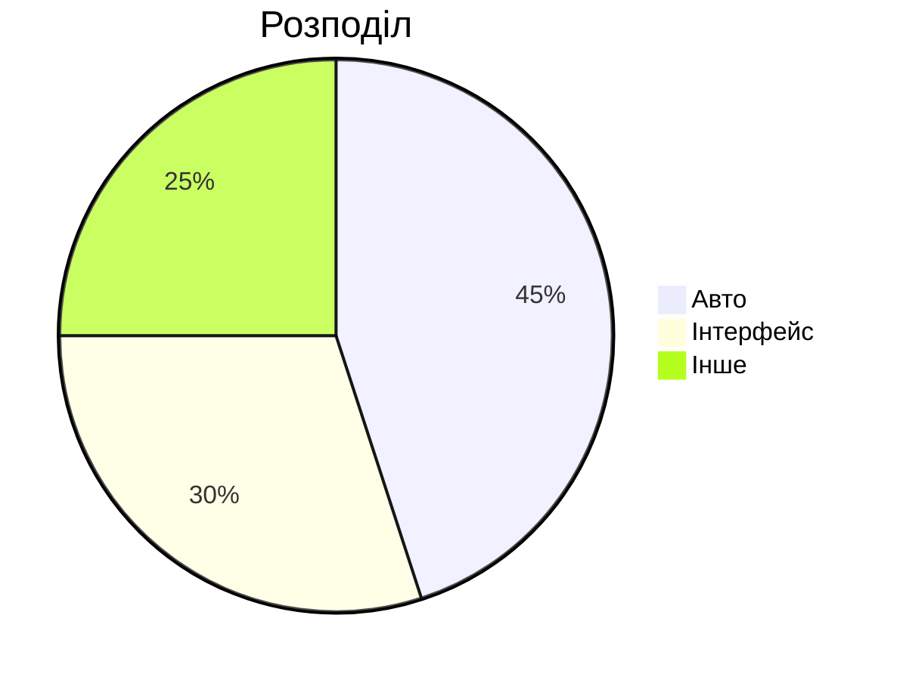
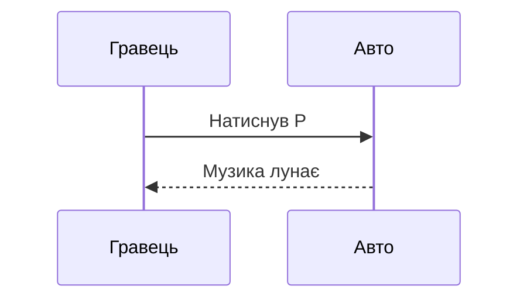

# Підручник автора HoRP-wiKi
## Як писати `.md` файли (детальна документалка)

Цей документ — **не про те, як працює сайт**. Це інструкція виключно про те, **як писати текстові файли `*.md`**, які потім стають статтями. Тут немає слів "сервер", "скрипт", "репозиторій" у технічному сенсі. Тут лише те, що ви вводите з клавіатури, і те, що з цього вийде.

Читайте його як довідник. Якщо ви ніколи не писали Markdown — почніть з розділу 1, далі йдіть поспіль. Якщо шукаєте конкретну річ — скористайтеся змістом.

---

## Зміст

1. [Що таке `.md` файл і з чого він складається](#1-що-таке-md-файл)
2. [Front matter — службовий блок на початку](#2-front-matter)
3. [Заголовки](#3-заголовки)
4. [Абзаци та переноси рядків](#4-абзаци-та-переноси)
5. [Виділення тексту (жирний, курсив, тощо)](#5-виділення-тексту)
6. [Списки (марковані, нумеровані, вкладені)](#6-списки)
7. [Чеклісти (списки завдань)](#7-чеклісти)
8. [Цитати та блоки уваги](#8-цитати-та-блоки-уваги)
9. [Таблиці](#9-таблиці)
10. [Код: інлайн та блоки](#10-код)
11. [Посилання](#11-посилання)
12. [Зображення](#12-зображення)
13. [Горизонтальні лінії](#13-горизонтальні-лінії)
14. [Кольори (HEX, RGB, HSL)](#14-кольори)
15. [Бейджі](#15-бейджі)
16. [Спойлери](#16-спойлери)
17. [Згадки та номери](#17-згадки-та-номери)
18. [Математичні формули](#18-математичні-формули)
19. [Виноски](#19-виноски)
20. [Емодзі](#20-емодзі)
21. [YouTube відео](#21-youtube)
22. [Діаграми Mermaid](#22-mermaid)
23. [HTML усередині Markdown](#23-html)
24. [Екранування спецсимволів](#24-екранування)
25. [Що НЕ працює (компроміси та обмеження)](#25-що-не-працює)
26. [Приклад готової статті цілком](#26-приклад-готової-статті)
27. [Чек-лист перед збереженням](#27-чек-лист)

---

## 1. Що таке `.md` файл

`.md` — це скорочення від **Markdown**. Це звичайний текстовий файл, у якому ви пишете не як у Word (кнопками "Жирний"), а **спеціальними символами**. Ці символи кажуть: "ось тут має бути заголовок", "ось тут — список".

> 💡 **Чому так, а не просто текст?** Бо Markdown одночасно і читається людиною (ви бачите `**жирний**` і розумієте суть), і перетворюється на гарний оформлений текст. Один і той самий файл можна прочитати у блокноті і побачити красивим на сайті.

Структура будь-якого файлу статті:

```
[необов'язковий блок front matter]
[порожній рядок]
[основний текст у синтаксисі Markdown]
```

Файл обов'язково має назву, що закінчується на `.md`, наприклад `Програвач касет.md`.

> ⚠️ **Найчастіша помилка новачка:** писати у `.txt` або `.docx`. Це не спрацює. Лише `.md`.

---

## 2. Front matter

**Front matter** — це службовий блок у самому початку файлу. Він написаний мовою **YAML** (це просто "ключ: значення"). Він *не видно* як звичайний текст читачу, але з нього беруться назва статті, опис, теги тощо.

### Як виглядає

Блок завжди починається і закінчується рядком із трьох дефісів `---`:

```markdown
---
title: Касетний програвач автомобіля
category: Машини/Механіки
summary: Вбудована система відтворення музики з касет.
author: System
created: 2026-07-05
tags: [музика, касети, автомобіль]
status: Стабільна
---

# (тут починається сама стаття)
```

### Правила написання front matter

| Правило | Чому |
|--------|------|
| Першим рядком файлу має бути `---` (без пробілів перед ним) | Інакше блок не розпізнається і весь текст покаже як звичайний |
| Другим рядком — `---` після останнього поля | Інакше блок не закриється |
| Між ключем і значенням — `: ` (двокрапка + один пробіл) | Парсер шукає саме такий формат |
| Кожне поле — з нового рядка | YAML — це построчковий формат |
| Список тегів — в один рядок у квадратних дужках | `[тег1, тег2]` — інакше зламається |

### Усі можливі поля

| Поле | Треба? | Що писати | Приклад |
|------|:------:|-----------|---------|
| `title` | бажано | Назва статті | `title: Касетний програвач` |
| `category` | бажано | Категорія (часто із слешем для підкатегорії) | `category: Машини/Механіки` |
| `summary` | бажано | Короткий опис 1–2 речення | `summary: Опис механіки.` |
| `author` | ні | Хто написав | `author: System` |
| `created` | ні | Дата у форматі РРРР-ММ-ДД | `created: 2026-07-05` |
| `tags` | ні | Список ключових слів | `tags: [музика, авто]` |
| `status` | ні | Статус надійності | `status: Стабільна` або `Чернетка` |

### Компроміси

- **Чому `title` краще писати завжди?** Якщо не написати, назва візьметься з імені файлу. А ім'я файлу може бути `Програвач касет v2 (копія).md` — і назва статті буде потворною.
- **Чому `summary` важливе?** Воно показується у списках і пошуку. Без нього там буде порожньо або обрізаний шматок тексту.
- **Чому дата саме `РРРР-ММ-ДД`?** Такий формат сортується правильно (01.02.2026 < 01.03.2026). Якщо писати `5 лютого`, машина не зрозуміє порядок.
- **Багаторядкові значення не підтримуються.** Не можна писати:
  ```markdown
  summary: Це довгий опис,
  який продовжується на іншому рядку.
  ```
  Пишіть в один рядок.

### Якщо значення містить двокрапку або лапки

Беріть у лапки:
```markdown
title: "HoRP: версія 0.0.6a"
```

---

## 3. Заголовки

Заголовки робляться решітками `#`. Кількість решіток = рівень (від 1 до 6).

```markdown
# Заголовок 1 рівня (найбільший)
## Заголовок 2 рівня
### Заголовок 3 рівня
#### Заголовок 4 рівня
##### Заголовок 5 рівня
###### Заголовок 6 рівня
```

### Правила

- Між `#` і текстом **обов'язково пробіл**: `#Текст` не спрацює, треба `# Текст`.
- Один `#` (рівень 1) у тілі статті **краще не використовувати**, бо назва статті вже показується окремо зверху. Починайте з `##`.

> 💡 **Логіка ієрархії:** уявіть книгу. `#` — назва книги, `##` — назва розділу, `###` — підрозділу. Не стрибайте з `##` одразу на `####` — це заплутує.

---

## 4. Абзаци та переноси

- **Абзац** — це текст, відокремлений з обох боків **порожнім рядком**.

```markdown
Це перший абзац.

Це другий абзац.
```

- Якщо просто натиснути Enter без порожнього рядка, рядки зіллються в один абзац (але з м'яким переносом).

Щоб примусово перенести рядок у межах одного абзацу, поставте **два пробіли в кінці рядка** (і Enter):

```markdown
Перша лінія··
Друга лінія
```
(· позначає пробіл).

Також можна вставити явний перенос теґом HTML `<br>`:

```markdown
Перша лінія<br>
Друга лінія
```

> ⚠️ **Компроміс:** дві решітки/літери на початку рядка можуть сприйнятися не як текст. Завжди лишайте порожній рядок між заголовком і текстом.

---

## 5. Виділення тексту

| Вигляд | Як написати | Що вийде |
|--------|-------------|----------|
| **Жирний** | `**жирний**` або `__жирний__` | **жирний** |
| *Курсив* | `*курсив*` або `_курсив_` | *курсив* |
| ***Жирний курсив*** | `***текст***` | ***текст*** |
| ~~Закреслений~~ | `~~текст~~` | ~~текст~~ |
| Підсвічений | `==текст==` | ==текст== |
| `Код у рядку` | `` `код` `` | `код` |

> 💡 **Чому `==текст==` це підсвічування, а не підкреслення?** У коді два правила борються: одне робить підкреслення, інше — підсвічування жовтим. Друге має пріоритет, тому фактично ви отримаєте *підсвічений* фрагмент. Використовуйте його для акцентів на важливому.

> ⚠️ **Пастка:** якщо поставити одну зірочку без пари — `текст *такий` — виділення не спрацює і читач побачить сирі зірочки. Завжди закривайте символом-відкривачем.

### Вкладення

Можна комбінувати: `**жирний *з курсивом* всередині**` → **жирний *з курсивом* всередині**.

---

## 6. Списки

### Маркований (з кульками)

Використовуйте `-`, `*` або `+` на початку рядка:

```markdown
- Перший пункт
- Другий пункт
- Третій пункт
```

### Нумерований

Крапка після числа:

```markdown
1. Перший
2. Другий
3. Третій
```

> 💡 Числа можна навіть не збільшувати — пишіть усюди `1.` — вони все одно пронумеруються по порядку. Але для читабельності вихідного файлу краще ставити правильні.

### Вкладені списки

Робляться **відступом** (2 або 4 пробіли) під пунктом:

```markdown
1. Основний пункт
   - Вкладений
   - Ще один
2. Наступний основний
   1. Вкладений нумерований
```

> ⚠️ **Важливо:** відступ має бути **пробілами**, а не табуляцією (Tab). Деякі редактори автоматично перетворюють Tab на пробіли — перевірте. Якщо вкладення "не працює", скоріш за все, там Tab.

---

## 7. Чеклісти

Це списки із галочками. Пишуться як маркований список, але після `-` йде `[ ]` (пусто) або `[x]` (заповнено):

```markdown
- [x] Завершене завдання
- [ ] Незавершене завдання
- [ ] Ще одне
```

> 💡 Галочки показуються, але їх **не можна клікати** (вони заблоковані для перемикання). Це просто візуальний стан.

---

## 8. Цитати та блоки уваги

### Звичайна цитата

Кутова дужка `>` на початку рядка:

```markdown
> Це цитата.
> Друга лінія цитати.
```

Вкладені цитати — додайте ще один `>`:

```markdown
> Рівень 1
>> Рівень 2
>>> Рівень 3
```

### Блоки уваги (alerts)

Спеціальний синтаксис для виділених повідомлень. Пишеться як цитата з `[!ТИП]`:

```markdown
> [!INFO] Це інформаційне повідомлення.
> [!WARNING] Будьте обережні з цим.
> [!ERROR] Сталася помилка.
> [!SUCCESS] Операцію успішно виконано.
```

Підтримувані типи: `INFO`, `WARNING`, `ERROR`, `SUCCESS`. Після типу — пробіл і текст.

> 💡 Використовуйте ці блоки замість звичайних цитат, коли хочете привернути увагу до важливого/небезпечного. Вони підсвічуються кольором.

---

## 9. Таблиці

Таблиці пишуться "лініями-роздільниками". Перший рядок — заголовки (через `|`), другий — роздільник (`|---|`), далі — дані.

```markdown
| Назва | Опис | Ціна |
|-------|------|------|
| Касета | Музика | 50 |
| Паспорт | Документ | 0 |
```

### Вирівнювання колонок

Додайте двокрапки у роздільник:

```markdown
| Ліворуч | По центру | Праворуч |
|:--------|:--------:|---------:|
| текст   | текст    | текст    |
```

- `:---` — ліворуч
- `:---:` — по центру
- `---:` — праворуч

> ⚠️ **Компроміс:** кількість `|` має збігатися в усіх рядках. Якщо забудете одну вертикальну риску — таблиця "поїде". Рахуйте вертикальні риски.

> 💡 У комірках таблиці можна використовувати виділення (`**жирний**`), але не можна робити абзаци з порожнім рядком.

---

## 10. Код

### Інлайн-код

Одинарні зворотні лапки (апостроф-ґравіс, клавіша ліворуч від `Є`/`1`):

```markdown
Використайте команду `print()` для виводу.
```

### Блок коду

Три зворотні лапки окремим рядком, потім код, потім знову три лапки:

````markdown
```
тут звичайний код без підсвітки
```
````

Щоб з'явилася **підсвітка синтаксису** (кольорове виділення), вкажіть мову після відкривних лапок:

````markdown
```python
def hello():
    print("Привіт")
```
````

Підтримувані мови для підсвітки: `javascript`, `python`, `lua`, `html`, `css` та базові. Якщо вкажете невідому мову (наприклад `rubby`), підсвітки не буде, але код покаже правильно.

> ⚠️ **Пастка новача:** не плутайте зворотні лапки `` ` `` із звичайними `'`. Треба саме ґравіс (клавіша під `Esc`).

> 💡 У блоках коду **нічого не форматується** — все показується "як є". Це ідеально для прикладів команд.

---

## 11. Посилання

### Зовнішнє посилання

```markdown
[Текст, який бачить читач](https://example.com)
```

### Посилання з підказкою (title)

```markdown
[Текст](https://example.com "Підказка при наведенні")
```

### Авто-посилання

Просто вставте URL у текст — він стане клікабельним:

```markdown
Зайдіть на https://example.com сьогодні.
```

> ⚠️ **Компроміс щодо внутрішніх посилань:** посилання на інші статті вказуються відносним шляхом від папки `pages/`, і пробіли в назвах замінюються на `%20`:
> ```markdown
> [Документи](Ігрові%20механіки/Документи)
> ```
> Такі посилання відкриваються окремим вікном. Не використовуйте їх усередині речень як основну навігацію — краще у розділі "Пов'язані статті" в кінці.

---

## 12. Зображення

Синтаксис схожий на посилання, але з `!` на початку:

```markdown

```

- **Альтернативний текст** — що побачить людина, якщо картинка не завантажиться (і для незрячих). Обов'язково пишіть змістовний.
- **Локальне зображення** (файл поряд зі статтею): `` — шлях вказується відносно теки статті.
- **Інтернет-URL**: ``.

> ⚠️ **Компроміс:** локальні картинки мають лежати у відповідній папці (зазвичай `images/` поряд із `.md` файлом). Якщо файлу немає — побачите "зламану" іконку. Перевіряйте шлях.

---

## 13. Горизонтальні лінії

Щоб відокремити великі блоки тексту лінією, поставте три або більше дефісів/зірочок/підкреслень у окремому рядку:

```markdown
---

***

___
```

> ⚠️ Між лінією та текстом зверху/знизу бажано лишати порожній рядок, інакше рядок тексту може випадково перетворитися на заголовок (якщо там `#`).

---

## 14. Кольори

Спеціальна фіча: якщо написати колір у форматі HEX, RGB або HSL, він покажеться як кольоровий блок із самим значенням.

```markdown
#0969DA
rgb(9, 105, 218)
hsl(212, 92%, 45%)
```

- HEX: `#` + 6 шістнадцяткових символів (`#RRGGBB`).
- RGB: `rgb(червоне, зелене, синє)` — числа від 0 до 255.
- HSL: `hsl(відтінок, насиченість%, яскравість%)`.

> 💡 Зручно для документації інтерфейсів, де треба показати колір елемента.

> ⚠️ HEX-колір на початку рядка без пробілу може бути сприйнятий неправильно. Пишіть колір із пробілом перед ним або окремим рядком.

---

## 15. Бейджі

Маленькі кольорові мітки. Синтаксис:

```markdown
::badge(blue)Текст::
::badge(green)Готово::
::badge(red)Помилка::
::badge(yellow)Увага::
::badge(purple)Нова::
```

Доступні кольори: `blue`, `green`, `red`, `yellow`, `purple`. Текст пишеться між `::` навколо.

> 💡 Добре для статусів у таблицях або на початку статті: `::badge(green)Стабільна::`.

---

## 16. Спойлери

Щоб сховати текст під "спойлер", використовуйте:

```markdown
>! Прихований текст, який не варто бачити відразу !<
```

> ⚠️ Цей синтаксис працює на окремому рядку. Текст між `>!` і `!<` буде у блоці-спойлері.

---

## 17. Згадки та номери

- `@ім'я` перетворюється на виділену згадку користувача: `@DavoZen`.
- `#123` перетворюється на виділену згадку номера (випуску/задачі).

```markdown
Дякую @DavoZen за допомогу. Дивіться також #42.
```

> 💡 Корисно в документації, щоб позначати авторів чи номери пов'язаних завдань.

> ⚠️ **Обережно:** якщо ви напишете `# 123` (з пробілом після ґратики) — це сприйметься як заголовок 1 рівня, а не згадка. Пишіть `#123` без пробілу.

---

## 18. Математичні формули

- **У рядку:** `$E=mc^2$` → показує формулу всередині тексту.
- **Окремим блоком:** `$$E=mc^2$$` на окремих рядках → велика формула.

```markdown
Рівняння Ейнштейна: $E=mc^2$.

$$
a^2 + b^2 = c^2
$$
```

> 💡 Для ігор зазвичай не потрібно, але є, якщо описуєте формули (наприклад, розрахунок шкоди).

---

## 19. Виноски

Позначте місце у тексті `[^1]`, і воно перетвориться на маленький індекс:

```markdown
Це важливий факт[^примітка].

Інший факт[^два].
```

> ⚠️ **Компроміс:** система просто нумерує такі позначки і виводить їхній вміст у блоці "Footnotes" внизу. Вона не прив'язує визначення автоматично — просто показує текст, який ви вказали у дужках, як виноску. Не розраховуйте на повноцінні виноски як у Wikipedia.

---

## 20. Емодзі

Два варіанти:

1. **Прямий символ** — просто вставте емодзі з клавіатури/clipboard: `🔥 🚀 ⚠️`.
2. **Через код** — `:назва_емодзі:` перетворюється на символ, якщо назва відома:
   ```markdown
   :smile: :fire: :rocket: :heart:
   ```

> ⚠️ **Компроміс:** не всі назви емодзі розпізнаються. Якщо назви немає у словнику — ви побачите сирий `:unknown_emoji:`. Тому для гарантії краще вставляти емодзі як символ напряму (варіант 1).

---

## 21. YouTube

Просто вставте посилання на YouTube у окремий рядок — воно стане вбудованим відеоплеєром:

```markdown
https://www.youtube.com/watch?v=dQw4w9WgXcQ
```

Також підтриується скорочений формат `youtu.be/ID`.

> 💡 Не треба ніяких дужок чи спеціальних тегів — просто чисте посилання з нового рядка.

---

## 22. Mermaid

Mermaid дозволяє малювати схеми самим текстом. Оформіть блок коду з мовою `mermaid`:

````markdown

````

### Типи діаграм

| Тип | Для чого | Приклад заголовка |
|-----|----------|-------------------|
| `graph` / `flowchart` | Блок-схеми, процеси | `graph TD` |
| `sequenceDiagram` | Хто що кому надсилає | `sequenceDiagram` |
| `classDiagram` | Структури/класи | `classDiagram` |
| `stateDiagram-v2` | Стани об'єкта | `stateDiagram-v2` |
| `gantt` | Плани/терміни | `gantt` |
| `erDiagram` | Сутності та зв'язки | `erDiagram` |
| `pie` | Кругова діаграма | `pie title Назва` |

### Приклад sequenceDiagram

````markdown

````

### Приклад pie

````markdown

````

> 💡 Mermaid ідеальний для пояснення механік: "як працює програвач", "хто з ким взаємодіє". Краще тисячі слів іноді.

> ⚠️ **Компроміс:** синтаксис Mermaid чутливий до помилок. Одна друкарська помилка — і вся діаграма не побудується. Перевіряйте кожну дужку та стрілку. Тестуйте на офіційному сайті mermaid.js.org, якщо сумніваєтесь.

> ⚠️ Не вставляйте HTML чи Markdown усередину блоку `mermaid` — лише його власний синтаксис.

---

## 23. HTML усередині Markdown

Оскільки дозволений "сирий" HTML, можна вставляти HTML-теги просто в текст:

```markdown
<small>Дрібний текст</small>
<kbd>Ctrl</kbd> + <kbd>C</kbd>
<p style="color: red;">Червоний текст</p>
<br>
```

Корисні теги:
- `<br>` — перенос рядка.
- `<kbd>` — клавіша (як на клавіатурі).
- `<small>` — дрібний текст.
- `<sup>` / `<sub>` — верхній/нижній індекс.
- `<span style="...">` — довільне форматування через CSS.

> ⚠️ **Компроміс:** HTML працює, але робить файл менш "чистим" і важчим для редагування новачками. Використовуйте лише коли Markdown не вистачає.

---

## 24. Екранування спецсимволів

Якщо вам треба показати сирий символ, який зазвичай щось означає (`*`, `#`, `` ` ``, `_`, `~`), поставте перед ним **зворотний слеш** `\`:

```markdown
\*це не виділення, а просто зірочка\*
\# це не заголовок
\` не інлайн-код
```

Результат: \*це не виділення\*, \# не заголовок, \` не код.

> 💡 Екранування — це "вимкнення" спеціального значення символу. Коли сумніваєтесь, що символ перетвориться не на те — додайте `\` перед ним.

---

## 25. Що НЕ працює (компроміси та обмеження)

Чесний перелік того, чого очікувати не варто:

| Річ | Чому не працює / обмеження |
|-----|----------------------------|
| Символи `:назва:` для всіх емодзі | Словник обмежений; невідомі залишаються сирими. Краще вставляти емодзі символом. |
| Внутрішні посилання як повноцінна навігація | Вони відкриваються окремим вікном, а не перемикають сторінку. |
| Багаторядкові значення у front matter | Парсер читає лише "ключ: значення" в один рядок. |
| Вкладені теґи Prism для рідкісних мов | Підсвітка є лише для javascript, python, lua, html, css та базових. |
| Mermaid з помилкою синтаксису | Блок не побудується взагалі. |
| Таблиці з різною кількістю стовпців | "Поїдуть", бо парсер очікує однакову кількість `\|`. |
| Відступ у списках через Tab | Треба пробілами, інакше вкладення не розпізнається. |
| Локальні картинки без файлу | Покажеться "зламана" іконка. |
| `# 123` (з пробілом) як згадка | Сприйметься як заголовок 1 рівня. |
| Виноски як повноцінні (з авто-визначеннями) | Лише нумерують і виводять текст із дужок. |

> 💡 **Філософія компромісу:** система навмисно проста. Вона жертвує екзотичними фічами заради надійності й легкості редагування у блокноті. Якщо щось не працює — швидше за все, це не помилка, а свідома простота.

---

## 26. Приклад готової статті цілком

Ось як має виглядати повноцінний `.md` файл від початку до кінця:

````markdown
---
title: Касетний програвач автомобіля
category: Машини/Механіки
summary: Вбудована система відтворення музики з касет, звук чутний іншим гравцям поруч.
author: System
created: 2026-07-05
tags: [музика, касети, автомобіль]
status: Стабільна
---

## Огляд

Касетний програвач — це вбудована система відтворення музики. Звук лунає з динаміків авто і чутний іншим.

==Важливо:== музику чує не лише водій.

## Вимоги

| Вимога | Опис |
|--------|------|
| Касета | Має бути в рюкзаку |
| Дистанція | ~120 studs |

## Керування

- [x] Відтворення клавішею `P`
- [ ] Пауза клавішею `U`

> [!WARNING] Панель має бути видимою, інакше керування не працює.

## Як це працює



## Пов'язані статті

- [Приладова панель](Машини/Механіки/Приладова%20панель)
````

---

## 27. Чек-лист перед збереженням

Перед тим як ваш файл вважати готовим, пройдіться по пунктах:

- [ ] Файл має розширення `.md` (не `.txt`, не `.docx`).
- [ ] Перший рядок — `---`, останній рядок front matter — `---`.
- [ ] У front matter є `title` і `category`.
- [ ] Є `summary` (короткий).
- [ ] Між ключем і значенням front matter — `: ` (двокрапка + пробіл).
- [ ] Тіло статті починається з `##`, а не `#`.
- [ ] Заголовки мають пробіл після `#`.
- [ ] Списки мають порожній рядок перед і після.
- [ ] Вкладені списки — пробілами, не Tab.
- [ ] Таблиці мають однакову кількість `|` у кожному рядку.
- [ ] Блоки коду — з трьох зворотних лапок (не звичайних).
- [ ] Mermaid-блоки перевірені на синтаксис.
- [ ] Внутрішні посилання ведуть на правильні шляхи (пробіли → `%20`).
- [ ] Емодзі вставлені символом, якщо сумніваєтесь у `:назва:`.
- [ ] Немає Tab-символів там, де мають бути відступи.

---

> ✅ Якщо ви пройшли чек-лист — ваш `.md` файл написано правильно. Це все, що треба знати, щоб створювати якісні статті.

---

## Інші посібники

- [Швидкий старт](Швидкий%20старт) — короткий гайд за 5 хвилин.
- [Стиль написання](Стиль%20написання) — правила тону та термінології.
- [Робота з таблицями](Робота%20з%20таблицями) — детально про таблиці.
- [Діаграми Mermaid](Діаграми%20Mermaid) — детально про схеми.
- [FAQ автора](FAQ%20автора) — часті питання та відповіді.
